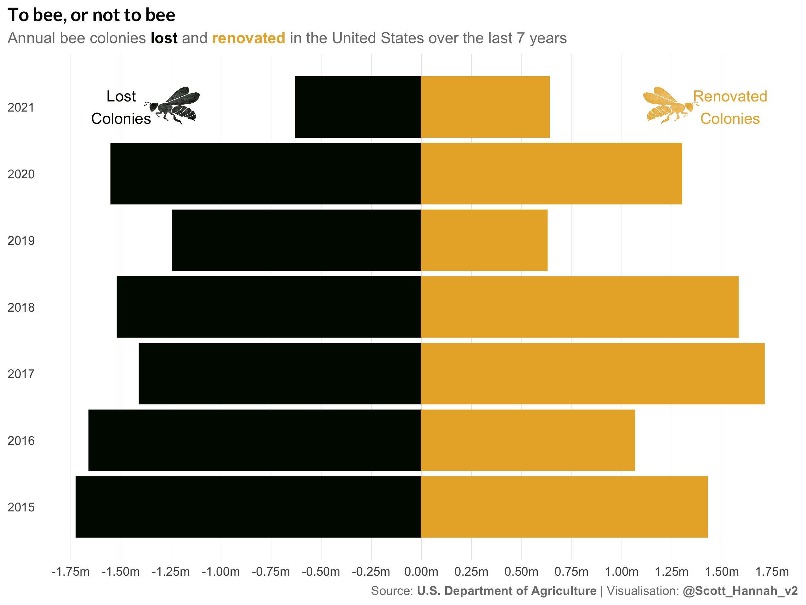

#TidyTuesday

My contributions to the #TidyTuesday challenge, a weekly social data project that focusses on understanding how to summarise and arrange data to make meaningful and/or beautiful charts with the {tidyverse} ecosystem.

##[2022-01-18](https://github.com/Scott-S-Hannah/tidytuesday/tree/main/2022/2022/2022-week_02)

Data: https://github.com/rfordatascience/tidytuesday/tree/master/data/2022/2022-01-11

