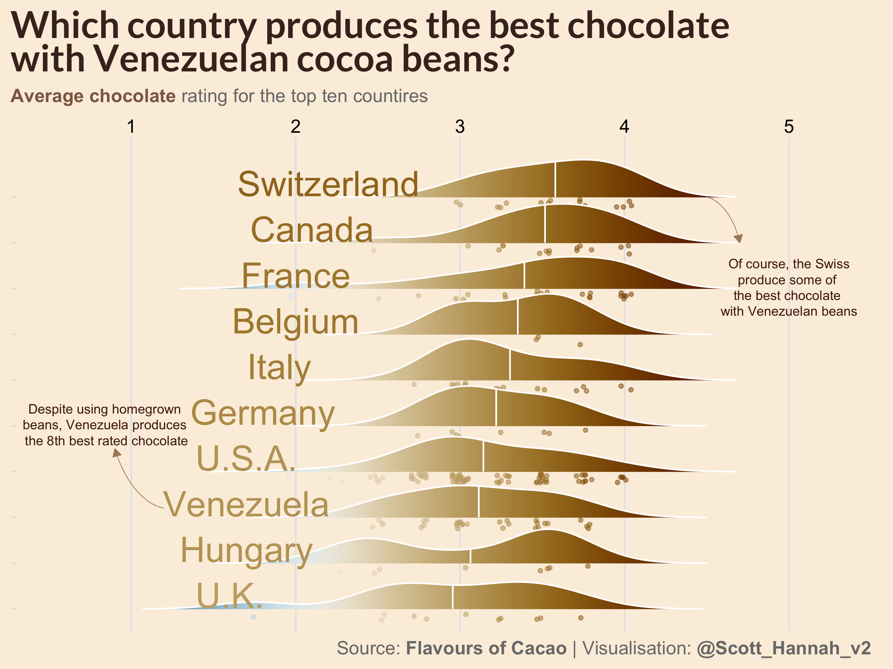
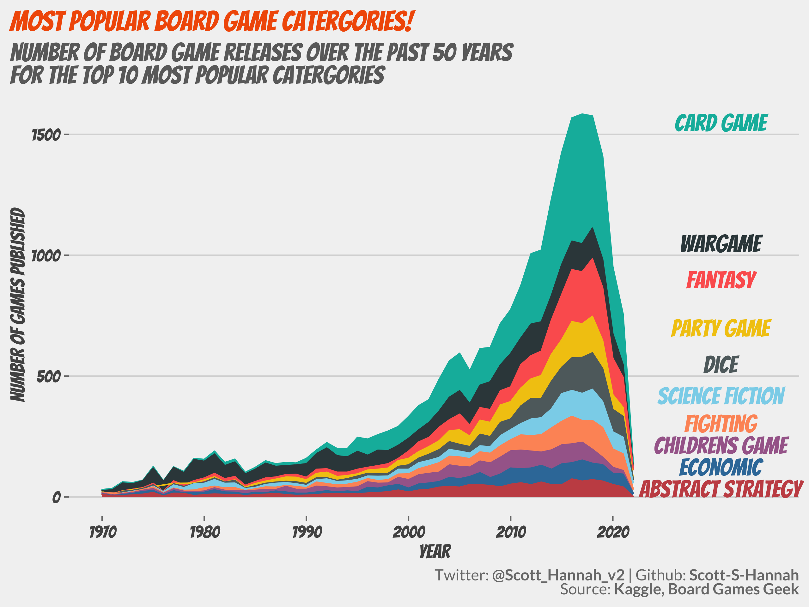

# TidyTuesday

My contributions to the [#TidyTuesday](https://github.com/rfordatascience/tidytuesday) challenge, a weekly social data project that focusses on understanding how to summarise and arrange data to make meaningful and/or beautiful charts with the `{tidyverse}` ecosystem.

## [2022-01-11](2022/2022-week_02)

Data: https://github.com/rfordatascience/tidytuesday/tree/master/data/2022/2022-01-11

[R Code here](2022/2022-week_02/bees.R)

## [2022-01-18](2022/2022-week_03)

Data: https://github.com/rfordatascience/tidytuesday/tree/master/data/2022/2022-01-18

[R Code here](2022/2022-week_03/chocolate-bar-ratings.R)

## [2022-01-25](2022/2022-week_04)

Data: https://github.com/rfordatascience/tidytuesday/tree/master/data/2022/2022-01-25

[R Code here](2022/2022-week_04/board-games.R)

## [2022-02-08](2022/2022-week_05)

Data: https://github.com/rfordatascience/tidytuesday/tree/master/data/2022/2022-02-01

[R Code here](2022/2022-week_05/dog-breeds.R)

